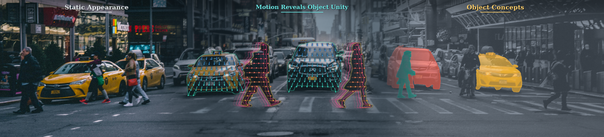

<h1 align="center">Object Concepts Emerge from Motion</h1>

<p align="center"><strong>Learning object-centric visual representations from raw video at scale</strong></p>

<p align="center">
  <strong>Boshi Li<sup>1</sup></strong>&nbsp;&nbsp;
  <strong>Xiaohui Wang</strong>&nbsp;&nbsp;
  <strong>Xiaoyang Wu<sup>2</sup></strong>&nbsp;&nbsp;
  <strong>Zhichao Li</strong>&nbsp;&nbsp;
  <strong>Ya Yang<sup>1</sup></strong>&nbsp;&nbsp;
  <strong>Naiyan Wang</strong>
</p>

<p align="center">
  <sup>1</sup>Beijing University of Posts and Telecommunications&nbsp;&nbsp;
  <sup>2</sup>The University of Hong Kong
</p>

<p align="center">
  <a href="https://tj12342.github.io/object-concepts-from-motion/"></a>
  <a href="https://arxiv.org/abs/2609.04348"></a>
  <a href="https://huggingface.co/tj111/object-concepts-from-motion"></a>
</p>

<p align="center">
  <a href="https://tj12342.github.io/object-concepts-from-motion/"></a>
</p>

## TL;DR

> **Motion is the teacher. The image encoder is the student.**
> We convert coherent motion in raw video into category-agnostic pseudo-instance supervision, then distill the resulting object-level structure into a single-image visual backbone. Motion is used only during pretraining; inference needs one image.

## Abstract

Object concepts are central to visual perception, but static appearance alone does not always reveal which pixels belong to the same physical entity. Inspired by developmental neuroscience, we use motion boundaries as a scalable source of object-level supervision. Optical flow and pixel clustering produce pseudo-instance masks, which train a single-image encoder with dense pairwise metric learning. The framework requires neither human annotations on the target videos nor camera calibration.

We extract **195M** motion-derived frames from **7,163 hours** of heterogeneous video and introduce Motion-Verified Self-Training to expand supervision to **421M** frames. A Swin-H teacher is distilled into a family of Swin backbones and transferred to monocular depth estimation, 3D object detection, 3D occupancy prediction, and end-to-end planning.

## Highlights

- **Object-centric supervision from motion:** coherent motion encourages within-object feature unity and separates neighboring instances without category labels.
- **Two-cycle scaling:** conservative Cycle-1 labels provide reliable seeds; Motion-Verified Self-Training recovers additional supervision from incomplete flow boundaries.
- **Single-image inference:** motion is used only to pretrain the representation. The released encoder consumes one RGB image and returns dense features.
- **Broad transfer:** the representation is evaluated across depth, 3D detection, occupancy, and planning, with especially strong behavior on geometry- and instance-sensitive tasks.

## What is released?

This repository contains a minimal, inference-only PyTorch implementation of the released Swin representation, a feature visualization demo, and adapters for three downstream projects. Checkpoints are hosted on [Hugging Face](https://huggingface.co/tj111/object-concepts-from-motion).


| 7,163 h | 195M | 421M | 5 | 4 |
| :---: | :---: | :---: | :---: | :---: |
| heterogeneous video | Cycle-1 frames | Cycle-2 frames | Swin variants | paper tasks |


The framework has two training cycles:

1. **Cycle 1: motion-derived supervision.** Reliable optical-flow boundaries and pixel clustering produce high-precision pseudo-instance masks. Dense features are trained to pull pixels from the same instance together and push different instances apart.
2. **Cycle 2: Motion-Verified Self-Training.** The Cycle-1 encoder proposes additional regions. Independent motion evidence verifies and refines those proposals, expanding supervision from 195M to 421M frames.
3. **Deployment.** A Swin-H teacher is distilled into a family of Swin backbones. The deployed encoder consumes a single RGB image and returns dense features.

## Quick start

### Install

The root environment is intentionally small and is only for checkpoint loading, the standalone forward pass, and feature visualization:

```bash
pip install -r requirements.txt
```

Downstream projects have separate, often incompatible environments. Follow the corresponding upstream README before installing a downstream adapter.

### Download a checkpoint

Download a released checkpoint from the [Model Zoo](https://huggingface.co/tj111/object-concepts-from-motion) and place it at the path expected by the tools:

```text
checkpoints/
  swin_t.pth
  swin_s.pth
  swin_b.pth
  swin_l.pth
  swin_h.pth
```

The checkpoints use MMPretrain parameter names. For downstream projects, the conversion steps and expected paths are documented in each local `FLOWSEG.md`.

### Visualize dense features

Run PCA visualization on one image:

```bash
python tools/feature_visualization.py assets/pic1.png \
    --arch huge \
    --checkpoint checkpoints/swin_h.pth \
    --output outputs/pic1_pca.png
```

The demo center-crops to 16:9, resizes to `512 x 288`, applies the reference RGB normalization, and uses CUDA when available. Select a device explicitly with `--device cpu` or `--device cuda`. The PCA colors are computed independently per image and indicate within-image feature similarity, not semantic class labels.

An interactive version is available in [`notebooks/feature_visualization.ipynb`](notebooks/feature_visualization.ipynb):

```bash
jupyter notebook notebooks/feature_visualization.ipynb
```

## Model zoo

All five released variants use the same hierarchical Swin design and differ only in capacity.

| Variant | CLI architecture | Embed dim | Stage depths | Attention heads | Checkpoint |
| --- | :---: | ---: | :---: | :---: | --- |
| Swin-T | `tiny` | 96 | 2, 2, 6, 2 | 3, 6, 12, 24 | `swin_t.pth` |
| Swin-S | `small` | 96 | 2, 2, 18, 2 | 3, 6, 12, 24 | `swin_s.pth` |
| Swin-B | `base` | 128 | 2, 2, 18, 2 | 4, 8, 16, 32 | `swin_b.pth` |
| Swin-L | `large` | 192 | 2, 2, 18, 2 | 6, 12, 24, 48 | `swin_l.pth` |
| Swin-H | `huge` | 384 | 2, 2, 18, 2 | 12, 24, 48, 96 | `swin_h.pth` |

## Downstream transfer

The representation is evaluated on geometry-, instance-, and planning-sensitive tasks. The released repository includes local adapters for the first three tasks; the planning result is reported in the paper but does not have a local adapter in this release.

| Task | Benchmark / framework | Reproduction entry point |
| --- | --- | --- |
| Monocular depth | KITTI / [DCDepth](https://github.com/w2kun/DCDepth) | [`downstream/DCDepth/FLOWSEG.md`](downstream/DCDepth/FLOWSEG.md) |
| 3D object detection | nuScenes / [BEVFormer](https://github.com/fundamentalvision/BEVFormer) | [`downstream/BEVFormerV2/FLOWSEG.md`](downstream/BEVFormerV2/FLOWSEG.md) |
| 3D occupancy | nuScenes / [SparseOcc](https://github.com/MCG-NJU/SparseOcc) | [`downstream/SparseOcc/FLOWSEG.md`](downstream/SparseOcc/FLOWSEG.md) |
| End-to-end planning | NAVSIMv2 / DriveSuprim | [Paper](https://arxiv.org/abs/2609.04348) |

### Selected paper results

| Task | Backbone | Metric | Result |
| --- | :---: | --- | :---: |
| KITTI Eigen depth | Swin-L | Abs Rel / RMSE / $\delta_1$ | **0.042 / 1.715 / 0.988** |
| nuScenes detection (1600 x 900) | Swin-H | NDS / mAP | **56.92 / 48.87** |
| nuScenes occupancy | Swin-L | RayIoU / RayIoU$_{1m}$ | **40.04 / 33.99** |
| NAVSIMv2 planning | Swin-L | EPDMS | **88.9** |

For the complete Cycle-2 pipeline, the Swin-H transfer results improve from **5.90 to 5.69 SILog** on KITTI depth, **56.80 to 56.92 NDS** on nuScenes detection, and **39.71 to 40.03 RayIoU** on nuScenes occupancy.

## Citation

If this work is useful to your research, please cite:

```bibtex
@article{li2026objectconcepts,
  title   = {Object Concepts Emerge from Motion},
  author  = {Li, Boshi and Wang, Xiaohui and Wu, Xiaoyang and Li, Zhichao and Yang, Ya and Wang, Naiyan},
  journal = {arXiv preprint arXiv:2609.04348},
  year    = {2026}
}
```

## License

This project is released under the [Apache 2.0 License](LICENSE). Please also check the licenses of the upstream downstream projects before redistribution.
